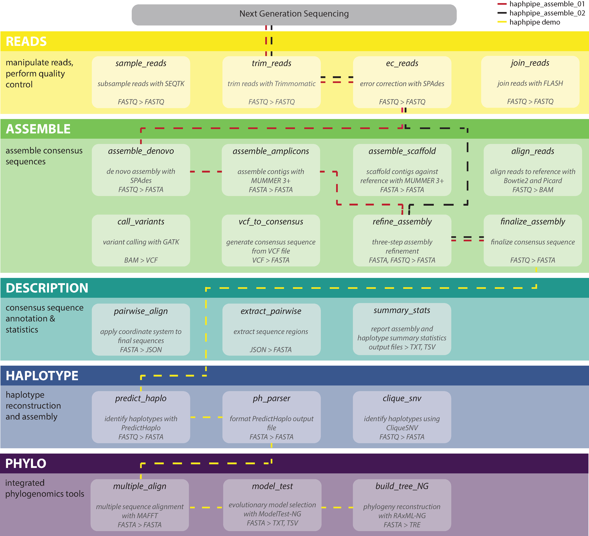
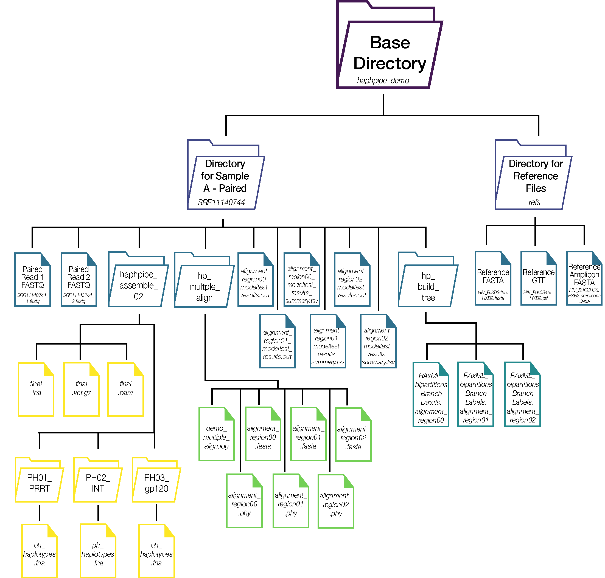

# HAPHPIPE [](http://bioconda.github.io/recipes/haphpipe/README.html)

_**HA**plotype and **PH**ylodynamics pipeline for viral assembly, population genetics, and phylodynamics._

Our full User Guide is available [here](https://gwcbi.github.io/haphpipe_docs/).



## Installation

[](http://bioconda.github.io/recipes/haphpipe/README.html)

__1. Create a conda environment with HAPHPIPE__

```bash
conda create -n haphpipe haphpipe
```

__2. Activate the environment__

```
conda activate haphpipe
```

__3. Install GATK__

Due to license restrictions, bioconda cannot distribute
and install GATK directly. To fully install GATK, you must
download a licensed copy of GATK (version 3.8-0) from the Broad Institute:
[https://software.broadinstitute.org/gatk/download/archive](https://software.broadinstitute.org/gatk/download/archive).

Register the package using gatk3-register:

```
gatk3-register /path/to/GenomeAnalysisTK-3.8-0-ge9d806836.tar.bz2
```

This will copy GATK into your conda environment.

NOTE: HAPHPIPE was developed and tested using GATK 3.8.

## Demo

After successful installation, the demo dataset can be run to ensure HAPHPIPE is installed and set up correctly. 

Running the demo is simple and requires a single command:
`hp_demo`

A specific outdirectory can be specified by:
`hp_demo --outdir $outdir_name`

The output of the entire demo is as such


If running the entire demo is not desired, this command can be executed to just pull the references included in HAPHPIPE into the directory that is specified (default is `.`).

`hp_demo --refonly`

Output on the terminal is as such, and the three HIV reference files are located in the subdirectory `refs`. See the [User Guide](https://gwcbi.github.io/haphpipe_docs/install/#reference-files) for more information regarding these reference files.

```
/base/directory/path/of/haphpipe)
Demo was run with --refonly. References are now in outdirectory: $outdir_name/haphpipe_demo/refs.

```

## Pipelines

##### `haphpipe_assemble_01`

This pipeline implements amplicon assembly using a denovo approach. Reads are
error-corrected and used to refine the initial assembly, with up to 5
refinement steps.

##### `haphpipe_assemble_02`

This pipeline implements amplicon assembly using a reference-based mapping 
approach. Reads are error-corrected and used to refine the initial assembly,
with up to 5 refinement steps.

See more information regarding the pipelines at the [wiki](https://github.com/gwcbi/haphpipe/wiki/Example-Pipelines).


## Stages

Each stage can be run on its own. Stages are grouped into 5 categories: hp_reads, hp_assemble, hp_haplotype, hp_description, and hp_phylo.
More detailed description of command line options for each stage are available in the [wiki](https://github.com/gwcbi/haphpipe/wiki). To view all available stages in HAPHPIPE, run: 
```
haphpipe -h
```


### Reads

Stages to manipulate reads and perform quality control. Input is reads in FASTQ format, output is modified reads in FASTQ format.

##### sample_reads

Subsample reads using seqtk ([documentation](https://github.com/lh3/seqtk)). Input is reads in FASTQ format. Output is sampled reads in FASTQ format.
Example to execute:
```
haphpipe sample_reads --fq1 read_1.fastq --fq2 read_2.fastq --nreads 1000 --seed 1234
```

##### trim_reads

Trim reads using Trimmomatic ([documentation](http://www.usadellab.org/cms/?page=trimmomatic)). Input is reads in FASTQ format. Output is trimmed reads in FASTQ format.
Example to execute:
```
haphpipe trim_reads --fq1 read_1.fastq --fq2 read_2.fastq 
```

##### join_reads

Join reads using FLASH ([paper](https://www.ncbi.nlm.nih.gov/pubmed/21903629)). Input is reads in FASTQ format. Output is joined reads in FASTQ format.
Example to execute:
```
haphpipe join_reads --fq1 trimmed_1.fastq --fq2 trimmed_2.fastq
```

##### ec_reads

Error correction using SPAdes ([documentation](http://cab.spbu.ru/software/spades/)). Input is reads in FASTQ format. Output is error-corrected reads in FASTQ format.
Example to execute:
```
haphpipe ec_reads --fq1 trimmed_1.fastq --fq2 trimmed_2.fastq
```

### Assemble

Assemble consensus sequence(s). Input reads (in FASTQ format) are assembled 
using either denovo assembly or reference-based alignment. 
Resulting consensus can be further refined.

##### assemble_denovo

Assemble reads via de novo assembly using SPAdes ([documentation](http://cab.spbu.ru/software/spades/)). Input is reads in FASTQ format. Output is contigs in FNA format.
Example to execute:
```
haphpipe assemble_denovo --fq1 corrected_1.fastq --fq2 corrected_2.fastq --outdir denovo_assembly --no_error_correction TRUE
```
##### assemble_amplicons

Assemble contigs from de novo assembly using both a reference sequence and amplicon regions with MUMMER 3+ ([documentation](http://mummer.sourceforge.net/manual/)). Input is contigs and reference sequence in FASTA format and amplicon regions in GTF format.
Example to execute:
```
haphpipe assemble_amplicons --contigs_fa denovo_contigs.fa --ref_fa refSequence.fasta --ref_gtf refAmplicons.gtf
```

##### assemble_scaffold

Scaffold contigs against a reference sequence with MUMMER 3+ ([documentation](http://mummer.sourceforge.net/manual/)). Input is contigs in FASTA format and reference sequence in FASTA format. Output is scaffold assembly, alligned scaffold, imputed scaffold, and padded scaffold in FASTA format.
Example to execute:
```
haphpipe assemble_scaffold --contigs_fa denovo_contigs.fa --ref_fa refSequence.fasta
```

##### align_reads

Map reads to reference sequence (instead of running de novo assembly) using Bowtie2 ([documentation](http://bowtie-bio.sourceforge.net/bowtie2/index.shtml)) and Picard ([documentation](https://broadinstitute.github.io/picard/)). Input is reads in FASTQ format and reference sequence in FASTA format. 
Example to execute:
```
haphpipe align_reads --fq1 corrected_1.fastq --fq2 corrected _2.fastq --ref_fa refSequence.fasta
```

##### call_variants

Variant calling from alignment using GATK ([documentation](https://software.broadinstitute.org/gatk/download/archive)). Input is alignment file in BAM format and reference sequence in FASTA format (either reference from reference-based assembly or consensus final sequence from de novo assembly). Output is a Variant Call File (VCF) format file. 
Example to execute:
```
haphpipe call_variants --aln_bam alignment.bam --ref_fa refSequence.fasta
```

##### vcf_to_consensus

Generate a consensus sequence from a VCF file. Input is a VCF file. Output is the consensus sequence in FASTA format. 
Example to execute:
```
haphpipe vcf_to_consensus --vcf variants.vcf
```

##### refine_assembly

Map reads to a denovo assembly or reference alignment. Assembly or alignment is iteratively updated. Input is reads in FASTQ format and reference sequence (assembly or reference alignment) in FASTA format. Output is refined assembly in FASTA format.
Example to execute:
```
haphpipe refine_assembly --fq_1 corrected_1.fastq --fq2 corrected_2.fastq --ref_fa refSequence.fasta
```

##### finalize_assembly

Finalize consensus, map reads to consensus, and call variants. Input is reads in FASTQ format and reference sequence in FASTA format. Output is finalized reference sequence, alignment, and variants (in FASTA, BAM, and VCF formats, respectively).
```
haphpipe finalize_assembly --fq_1 corrected_1.fastq --fq2 corrected_2.fastq --ref_fa refined.fna 
```

### Haplotype

Haplotype assembly stages. HAPHPIPE implements PredictHaplo ([paper](https://www.ncbi.nlm.nih.gov/pubmed/26355517)), although other haplotype reconstruction programs can be utilized outside of HAPHPIPE using the final output of HAPHPIPE, typically with the final consensus sequence (FASTA) file, reads (raw, trimmed, and/or corrected), and/or final alignment (BAM) file as input.

##### predict_haplo

Haplotype identification with PredictHaplo. Input is reads in FASTQ format and and reference sequence in FASTA format. Output is the longest global haplotype file and corresponding HTML file. _Note: PredictHaplo must be installed separately before running this stage._ 
Example to execute:
```
haphpipe predict_haplo corrected_1.fastq --fq2 corrected_2.fastq --ref_fa final.fna
```

##### ph_parser

Return PredictHaplo output as a correctly formatted FASTA file. Input is the output file from _predict_haplo_ (longest global .fas file). Output is a correctly formatted FASTA file.
Example to execute:
```
haphpipe ph_parser best.fas
```

##### cliquesnv

Haplotype identification with CliqueSNV. Input is reads in FASTQ format and and reference sequence in FASTA format. Output is a FASTA file containing haplotypes with frequencies, a TXT file with CliqueSNV parameters and output, and a parsed summary TXT file (similar to the output of _ph_parser_). The CliqueSNV JAR file must be downloaded before running this stage, available [here](https://github.com/vtsyvina/CliqueSNV). If the file is not located in the current directory, provide the path to its directory using the `--jardir` option.
Example to execute:
```
haphpipe cliquesnv corrected_1.fastq --fq2 corrected_2.fastq --ref_fa final.fna
```


### Description

Stages to annotate and extract regions from sequences using a reference sequence and GTF file. Also includes a module that calculates summary statistics.

##### pairwise_align 

Apply correct coordinate system to final sequence(s) to facilitate downstream analyses. Input is the final sequence file in FASTA format, a reference sequence in FASTA format, and a reference GFT file. Output is a JSON file to be used in `extract_pairwise`.
Example to execute:
```
haphpipe pairwise_align --amplicons_fa final.fna --ref_fa refSequence.fasta --ref_gtf referenceSeq.gtf
```

##### extract_pairwise

Extract sequence regions from the pairwise alignment produced in `pairwise_align`. Input is the JSON file from `pairwise_align`. Output is either an unaligned nucleotide FASTA file, an aligned nucleotide FASTA file, an amino acid FASTA file, an amplicon GTF file, or a tab-separated values (TSV) file (default: nucleotide FASTA with regions of interest from GTF file used in `pairwise_align`). 
Example to execute:
```
haphpipe extract_pairwise --align_json pairwise_aligned.json --refreg HIV_B.K03455.HXB2:2085-5096
```

##### summary_stats 

Generates summary statistics for samples. Input in a TXT with a list of sample directories. Output is a TXT and TSV file.
Example to execute:
```
haphpipe summary_stats --dir_list demo_dir_list.txt --amplicons
```

### Phylo

Phylogenetic stages that include multiple sequence alignment, determination of best-fit model of evolution, and building phylogeny options.

##### multiple_align 

Aligns sequences using MAFFT. Input is a FASTA file with sequences wanting aligned and/or a TXT file with a list of directories AND a reference GTF file.
Example to execute: 
```
haphpipe multiple_align --dir_list demo_dir_list.txt -ref_gtf referenceSeq.gtf
```

##### model_test 

Determine best-fit evolutionary model with ModelTest-NG. Input is an aligned FASTA or PHYLIP file with sequences. Output is text file with ModelTest output showing best-fit models of evolution.
Example to execute: 
```
haphpipe model_test --seqs alignment.fasta
```

##### build_tree_NG 

Create phylogenetic tree with RAxML-NG. Input is an aligned FASTA or PHYLIP file with sequences. Output are tre files.
Example to execute: 
```
haphpipe build_tree_NG --seqs alignment.fasta --all --model GTR
```
